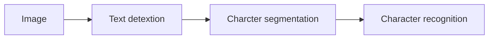

# Application: Photo OCR

## Question 1

Suppose you are running a sliding window detector to find text in images. Your input images are 1000x1000 pixels. You will run your sliding windows detector at two scales, 10x10 and 20x20 (i.e., you will run your classifier on lots of 10x10 patches to decide if they contain text or not; and also on

lots of 20x20 patches), and you will "step" your detector by 2 pixels each time. About how many times will you end up running your classifier on a single 1000x1000 test set image?

- [ ] 250,000

- [ ] 1,000,000

- [x] **500,000**

  > With a stride of 2, you will run your classifier approximately 500 times for each dimension. Since you run the classifier twice (at two scales), you will run it 2 * 500 * 500 = 500,000 times.

- [ ] 100,000

---

## Question 2

Suppose that you just joined a product team that has been developing a machine learning application, using $m = 1,000$ training examples. You discover that you have the option of

hiring additional personnel to help collect and label data. You estimate that you would have to pay each of the labellers $10 per hour, and that each labeller can label 4 examples per minute. About how much will it cost to hire labellers to label 10,000 new training examples?

- [ ] $250

- [ ] $10,000

- [x] **$400**

  > On labeller can label $4 \times 60 = 240$ examples in one hour. It will thus take him $10,000 / 240 \approx 40$ hours to complete 10,000 examples. At $\$10$ an hour, this is $400.

- [ ] $600

---

## Question 3

What are the benefits of performing a ceiling analysis? Check all that apply.

- [ ] If we have a low-performing component, the ceiling analysis can tell us if that component has a high bias problem or a high variance problem.

- [x] **It can help indicate that certain components of a system might not be worth a significant amount of work improving, because even if it had perfect performance its impact on the overall system may be small.**

  > An unpromising component will have little effect on overall performance when it is replaced with ground truth.

- [ ] A ceiling analysis helps us to decide what is the most promising learning algorithm (e.g., logistic regression vs. a neural network vs. an SVM) to apply to a specific component of a machine learning pipeline.

- [x] **It gives us information about which components, if improved, are most likely to have a significant impact on the performance of the final system.**

  > The ceiling analysis gives us this information by comparing the baseline overall system performance with ground truth results from each component of the pipeline.

---

## Question 4

Suppose you are building an object classifier, that takes as input an image, and recognizes that image as either containing a car ($y=1$) or not ($y=0$). For example, here are a positive example and a negative example:

After carefully analyzing the performance of your algorithm, you conclude that you need more positive ($y=1$) training examples. Which of the following might be a good way to get additional positive examples?

- [x] **Mirror your training images across the vertical axis (so that a left-facing car now becomes a right-facing one).**

  > A mirrored example is different from the original but equally likely to occur, so mirroring is a good way to generate new data.

- [ ] Take a few images from your training set, and add random, gaussian noise to every pixel.

- [ ] Take a training example and set a random subset of its pixel to 0 to generate a new example.

- [ ] Select two car images and average them to make a third example.

---

## Question 5

Suppose you have a PhotoOCR system, where you have the following pipeline:

You have decided to perform a ceiling analysis on this system, and find the following:

Which of the following statements are true?

- [x] **There is a large gain in performance possible in improving the character recognition system.**

  > Plugging in ground truth character recognition gives an 18% improvement over running the character recognition system on ground truth character segmentation. Thus there is a good deal of room for overall improvement by improving character recognition.

- [x] **Performing the ceiling analysis shown here requires that we have ground-truth labels for the text detection, character segmentation and the character recognition systems.**

  > At each step, we provide the system with the ground-truth output of the previous step in the pipeline. This requires ground truth for every step of the pipeline.

- [ ] The least promising component to work on is the character recognition system, since it is already obtaining 100% accuracy.

- [ ] The most promising component to work on is the text detection system, since it has the lowest performance (72%) and thus the biggest potential gain.